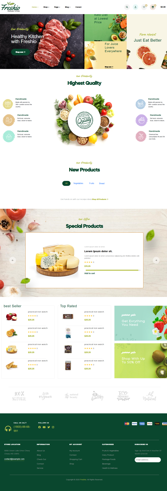

# Freshio - Organic Food Store Template

A clean, modern, and responsive **organic food store landing page** built with **HTML**, **CSS**, and vanilla **JavaScript**.  
This project is a **static replica** inspired by the Freshio theme from ThemeForest, created for learning and practice purposes.

🌐 **Live Demo**: [View Website](https://amelchenni.github.io/website-template-Freshio-Organic-FoodStore/)

---

## 🚀 Features
- Responsive layout optimized for desktop and mobile  
- Clean and modern design focused on organic products  
- Smooth hover effects and CSS transitions  
- Basic JavaScript for interactive elements (e.g., menu toggle)  
- Semantic HTML structure for accessibility and SEO  

---

## 🛠️ Built With
- HTML5  
- CSS3 (Flexbox, Grid, CSS Transitions)  
- JavaScript (Vanilla)

---

## 📌 Important Note
⚠️ This project does **not** include API or CRUD functionality.  
It is a **front-end only static template** inspired by the [Freshio Organic Food Store Theme](https://preview.themeforest.net/item/freshio-organic-food-store/full_screen_preview/34166286) from ThemeForest.  
All data is hardcoded for demonstration purposes.

---

## 📌 Future Improvements
Planned enhancements:  
- Convert to React for component-based architecture  
- Add API integration for dynamic product data  
- Implement product filtering, cart functionality, and CRUD operations  
- Add dark mode toggle and improve accessibility  

---

## 📷 Preview

